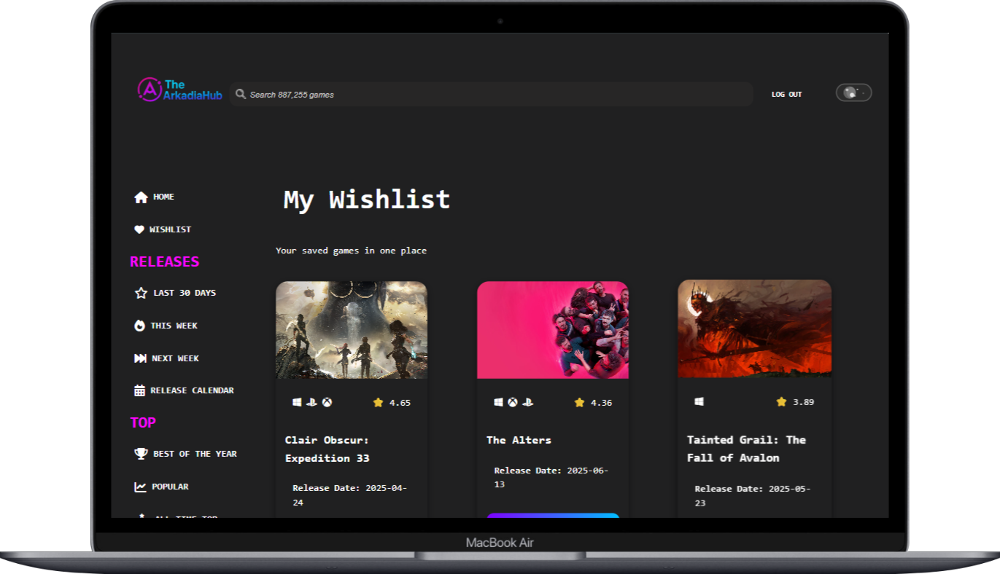

# 🎮 The Arkadia Hub

**The Arkadia Hub** is a web application built with **vanilla JavaScript** that allows users to discover, search, and explore video games in a dynamic and visual way. It uses the public [RAWG.io API](https://rawg.io/apidocs) to fetch real-time game data like images, ratings, genres, platforms, release dates, and more.

---

## 🧠 What’s it about?

This project simulates a video game platform where users can:

- Explore recent and popular releases  
- Search games by name  
- View detailed game information  
- Filter by genre, platform, and release window  
- **Add games to a personal Wishlist** stored in the cloud with Supabase  

---

## 🎯 What’s the goal?

The main goal was to **put into practice the core concepts learned during the first year of ThePower Web Development Master’s program**, such as:

- Modular, component-based architecture  
- Responsive web design  
- API consumption and asynchronous JS  
- `localStorage` usage for persistence  
- Cloud integration using Supabase  
- Real interactivity without frameworks

It’s also meant to serve as a **portfolio project** to present during interviews or showcase online.

---

## 🛠️ Technologies Used

- Semantic HTML5  
- Modern CSS (variables, Flexbox, Grid)  
- JavaScript (ESModules, Vanilla)  
- Vite (for development and bundling)  
- RAWG API (video game data)  
- Supabase (authentication + wishlist database)  
- Font Awesome (icons)  
- localStorage (for theme persistence)

---

## ✨ Extra Features

- 🌗 Light/Dark theme toggle  
- 📱 Fully responsive layout  
- 🔧 Modular component structure  
- ❤️ **Wishlist system** (add/remove favorites) with Supabase  
- 🔐 Auth system: login, signup, logout  
- 🧠 No frameworks used – just pure JS

---

## 🚀 Deployment

Live version available at:  
👉 **[TheArkadiaHub](https://thearkadiahub.vercel.app/)**

---

## 👨‍💻 Author

This project was developed by **[@serxa92](https://www.linkedin.com/in/sergio-agulla/)** using Vite and Vanilla JavaScript.

 
